# 1.git定义
git 是一个开源的分布式版本控制系统，用于敏捷高效地处理任何或小或大的项目。
## 1.1版本控制
版本控制是一种记录文件内容变化，便于将来查阅某个特定版本。最重要的就是你可以记录文件修改的历史记录，可以查看并切换版本。
## 1.2工作机制

创建的目录就是工作区，写了代码后放在暂存区让git知道，然后提交给本地库后可以生成历史记录。

工作区：写代码的地方

暂存区：数据暂时存放的地方

本地库：存放已提交的数据

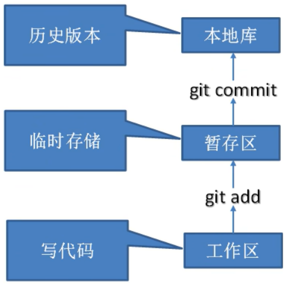
## 1.3代码托管中心
就是远程库，如github，可以把本地库push到远程库
# 2.常用基础命令

```bash
#设置用户签名 
git config --global user.name 用户名 
git config --global user.email 邮箱  
#初始化本地仓库，在本地拥有.git文件时才能使用git命令  
git init
#查看本地库状态
git status
#查看文件内容
cat 文件名 
#添加到暂存区
git add 文件名
#将当前目录下所有文件添加到暂存区
git add .
#将当前仓库所有文件添加到暂存区
git add -a
#提交到本地库
git commit -m 日志信息 文件名
#暂存并提交
git commit -am 信息
#删除文件
git rm 文件名
#删除目录
git rm -r 文件目录
#查看日志
git log
#查看历史记录
git reflog
#版本穿梭
git reset --hard 版本号
```

## 2.1文件修改
修改后的文件需要重新add并commit，红色表示未添加到暂存区，绿色表示已添加进暂存区但未提交到本地库

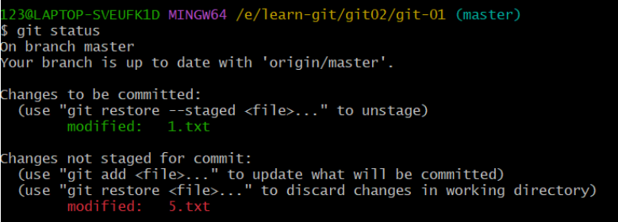

## 2.2文件删除

在本地删除文件后需要重新提交删除信息，add后再commit，不然删除的只是工作区的文件

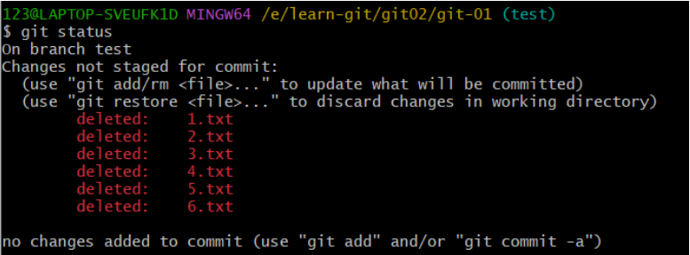
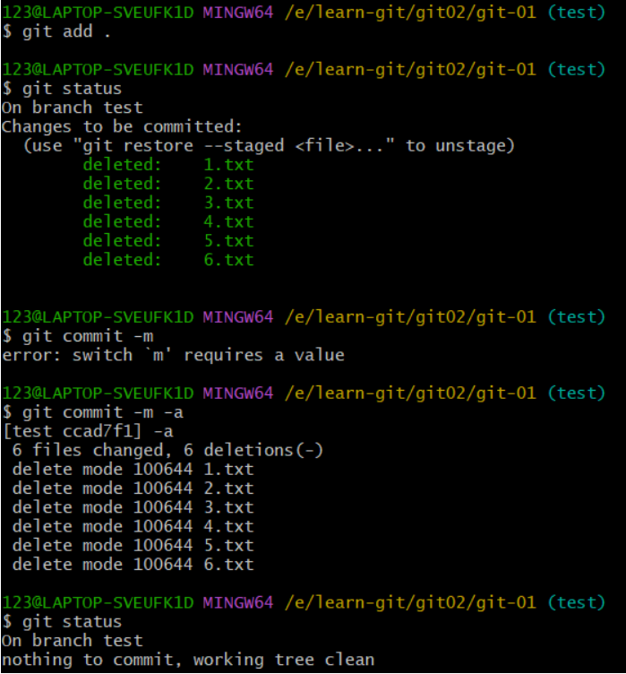

## 2.3文件暂存

stash指令，将修改的文件添加到存储区，不会提交文件，后面可以再从存存区中拿出来继续修改文件。存在.git/refs/stash中。

目的是为了在不提交文件的前提下对其他分支进行操作。

```bash
#保存当前未commit的代码
git stash save 'message'
#保存已跟踪和未跟踪的更改
git stash save --include-untracked 'message'
#查看存储区所有提交列表
git stash list
#弹出并使用最近一次存入的提交
git stash pop
#删除最近一次的存储
git stash drop
#清除所有存储记录
git stash clear
```

当前在test分支对文件进行操作，我的hello.txt还没有进行add和commit，如果此时进行切换分支，这个文件就会跑到另一个分支去，如果此时将文件放入存储区中就不会出现类似的问题。

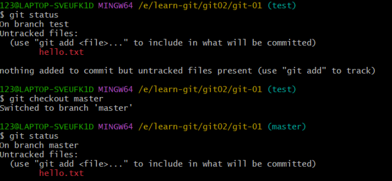
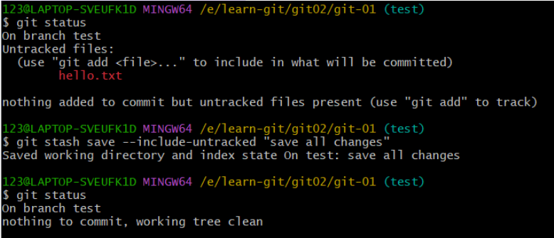


通过`git stash pop`弹出暂存文件，继续修改

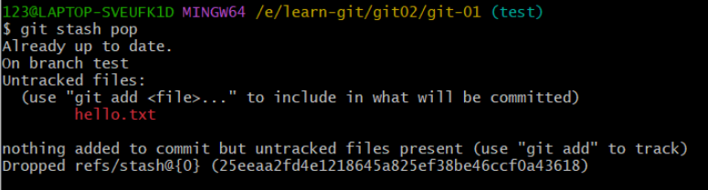

# 3.分支操作
## 3.1分支
一个分支就是一个单独的副本，类似于在复制的文件中进行操作，完成后再粘贴回去。
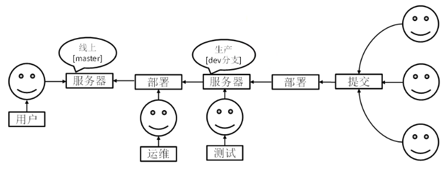
## 3.2常用分支命令
```bash
#创建分支
git branch 分支名
#查看分支
git branch -v
#查看哪些分支已合并到当前分支
git branch --merged
#切换分支
git checkout 分支名
git switch 分支名
#把指定的分支合并到当前分支上
git merge 分支名
#删除分支
git branch -d 分支名
#删除远程分支
git push 仓库别名 -d 分支名
#重命名分支
git branch 
```
## 3.3fetch指令

将更新的内容拉取到本地，但不会自动合并节点，需要手动合并。

在远程仓库中创建新分支new-test并修改了hello.txt文件，从本地拉取新分支

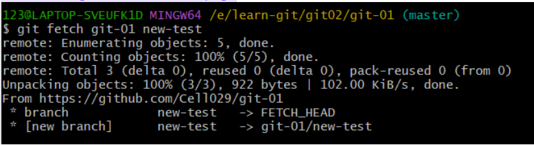

如果不转换到拉取的分支的话本地是看不到的

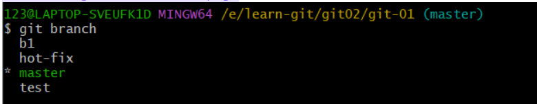
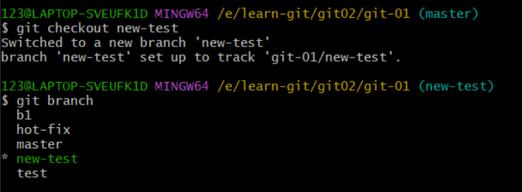

将修改后的新分支合并到主分支，完成操作

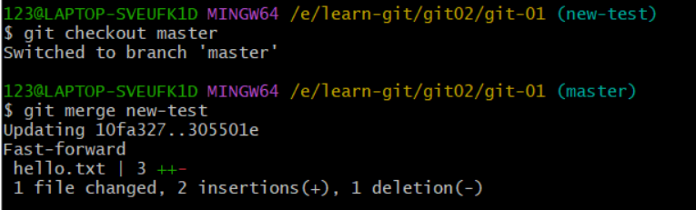

## 3.4pull指令

pull指令结合了fetch与merge指令，拉取最新修改的同时合并分支。

我在github上创建了new-test分支，并在这个分支上创建了文件，在本地库进行pull时，会自动将github上的new-test的新修改合并到当前分支，与fetch指令不同，fetch要手动切换分支后才能看到

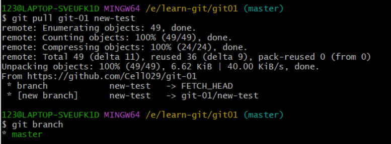

## 3.5switch与checkout指令

目前看来，checkout指令具有多种功能，所以才开发出switch指令，让变更分支的操作更直观。在使用checkout和switch的时候，都需要先将未提交的变更文件放入暂存区，否则变更分支的时候这个文件会跟着变。

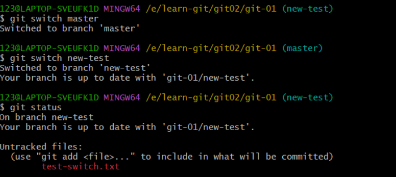

**checkout**

```bash
#切换分支
git checkout 分支名
#还原文件
git checkout --文件名
#提交切换版本
git checkout 版本号
```

## 3.6冲突合并

合并分支时，两个分支在同一个文件的同一个位置有两套完全不同的修改，git就会无法替我们决定使用哪一个，必须人为决定新代码的内容。并且合并分支修改的只有执行合并的那个分支，被合并的分支不会被修改。


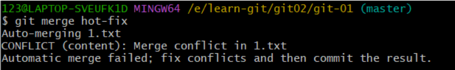

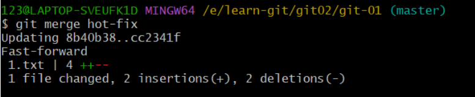

去掉文件中的多余信息，只留下要的内容，并再次添加提交该文件，commit时不要带上文件名

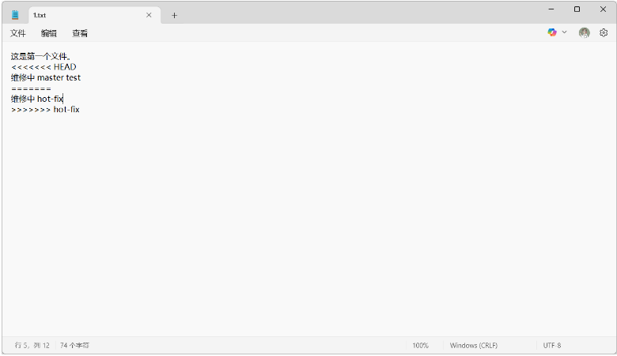

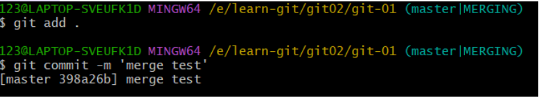
# 4.git团队协作机制
## 4.1团队内协作

用户1将本地库push到远程库，用户2从远程库中clone出来，用户2修改后再push到远程库，用户1再从远程库中pull修改后的代码更新本地代码。
## 4.2跨团队协作

团队2将团队1的代码从远程库中fork到团队2的远程库中，然后clone到本地库，修改后push到团队2的远程库，然后发起请求pull request，团队1审核后merge到团队1的远程库，然后pull到团队1的本地库。
# 5.github
## 5.1创建远程仓库

在github上创建
## 5.2创建远程仓库别名
```bash
#查看当前所有远程地址别名
git remote -v
#添加远程仓库
git remote add 别名 远程地址
#别名重命名
git remote rename 旧别名 新别名
#删除创建的别名
git remote remove 别名
```

## 5.3推送本地分支到远程仓库

`git push 别名 分支`，需要登录远程仓库后才行

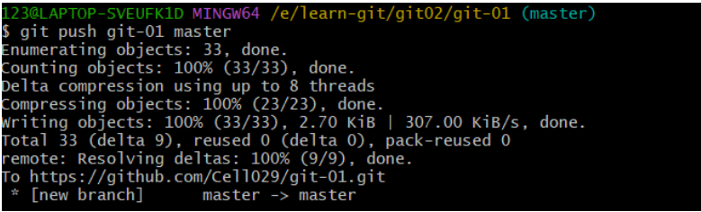
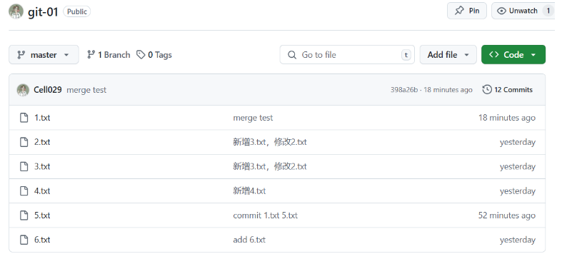
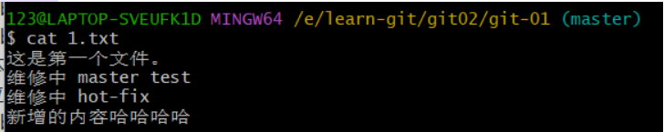
## 5.4克隆远程库到本地库
1. 拉取代码
2. 初始化本地库
3. 创建别名（origin）

`git clone 链接：`克隆不需要登录账号，只要有链接就可以

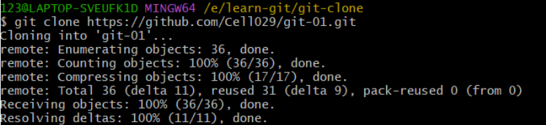

更新一下看下能否上传