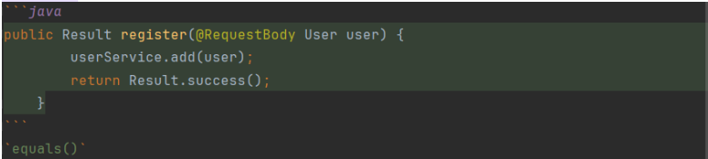

# 原理
将特定的符号与HTML标签的对应关系实现转换。
```
# -> <h1>, ## -> <h2>
**content** -> <strong>content</strong>
[content](url) -> <a herf="url">content</a>
```
# 标题
```
# 一级标题
## 二级标题
### 三级标题
#### 四级标题
##### 五级标题
###### 六级标题
```
# 常用语法
```
**文本**：加粗  
*文本*：斜体 
***文本***：斜体加粗  
~~文本~~：文本添加横杠 
==文本==：高亮
***：分界线 
```

***
# 列表
使用星号*、加号+、减号-作为无序列表标记，子列表换行并空4格
```
* 无序列表 1
* 无序列表2
    * 无序列表a
      * 无序列表i
    
使用数字作为有序列表

1. 有序列表1
2. 有序列表2
    1. 有序列表a 
  
`* [x] `:
* [x] 勾选框

`* [ ]` :
* [ ] 勾选框  
```

# 代码块


```java
public Result register(@RequestBody User user) {
        userService.add(user);
        return Result.success();
    }
```  
`equals()`
# 引用文本
`>`:
> 在丰富多彩的美食世界中，有一道看似平凡却独具魅力的菜肴——青椒炒豆皮。
> 它以其简单的食材组合和浓郁的鲜香味道，征服了无数人的味蕾。
> 对于美食爱好者来说，这道菜不仅是家常餐桌上的常客，更是能够带来满足和愉悦的美味佳肴。
> > 双层嵌套
> ```java
> public Result register(@RequestBody User user) {
> userService.add(user);
> return Result.success();
> }
> ```

# 超链接
`[文字](链接)`：

点击跳转至[百度首页](https://baidu.com)  

[百度][a],[火狐][b],[谷歌][c]

[a]: https://baidu.com
[b]: https://firefox.com
[c]: https://google.com


脚注[^1]

[^1]: 这是脚注1
# 插入图片


# 表格


| 姓名 | 年龄 |
|:--:|:--:|
| 小明 | 18 |
| 小红 | 19 |

```
<!--注释-->
```
# 内嵌html
**文本修饰类**
```
<p style="color: blue;">这段文字将显示为蓝色。</p>
```
<p style="color: blue;">这段文字将显示为蓝色。</p>

`<sup>`上标：ABC<sup>123</sup>

`<sub>`下标：ABC<sub>123</sub>  

`<mark>`高亮：<mark>ABC</mark>  

`<del>`删除线：<del>ABC</del>  

`<ins>`插入：<ins>ABC</ins>

`<ruby>`和`<rt>`文字注音：<ruby>饕餮 <rt>tāo tiè</rt></ruby>


